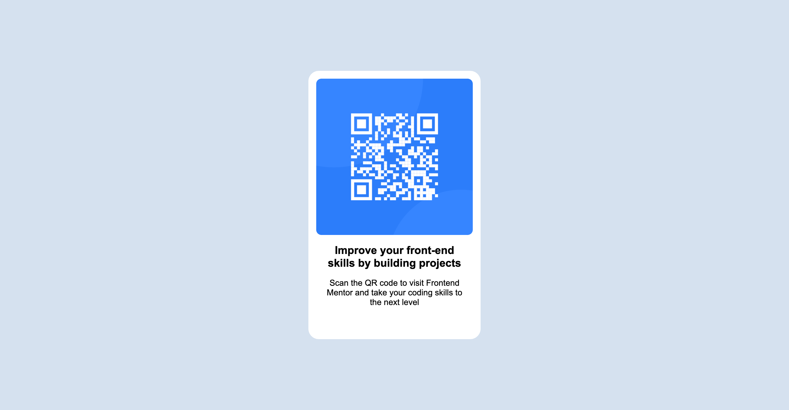

# Frontend Mentor - QR code component solution

This is a solution to the [QR code component challenge on Frontend Mentor](https://www.frontendmentor.io/challenges/qr-code-component-iux_sIO_H). Frontend Mentor challenges help you improve your coding skills by building realistic projects. 

## Table of contents

- [Overview](#overview)
  - [Screenshot](#screenshot)
  - [Links](#links)
- [My process](#my-process)
  - [Built with](#built-with)
  - [What I learned](#what-i-learned)
- [Author](#author)
- [Acknowledgments](#acknowledgments)

## Overview

### Screenshot

### Links

- Solution URL: [https://github.com/JustinMartz/justinmartz.github.io](https://github.com/JustinMartz/justinmartz.github.io)
- Live Site URL: [https://justinmartz.github.io](https://justinmartz.github.io)

## My process

I started with making a class for the outer box, sizing it, centering it, rounding the borders, then did the same for the inner box. I couldn't find a font like the design had that has the lowercase i with a dot and the lowercase t without the tail.

### Built with

- Visual Studio Code
- CSS custom properties
- Firefox

### What I learned

I learned how to apply what I've been studying with the Mozilla CSS guide. And I learned a how to set up a GitHug Pages site.

## Author

- Website - [Justin Martz](https://justinmartz.github.io)
- Frontend Mentor - [@JustinMartz](https://www.frontendmentor.io/profile/JustinMartz)

## Acknowledgments

Mozilla MDN Web Docs
